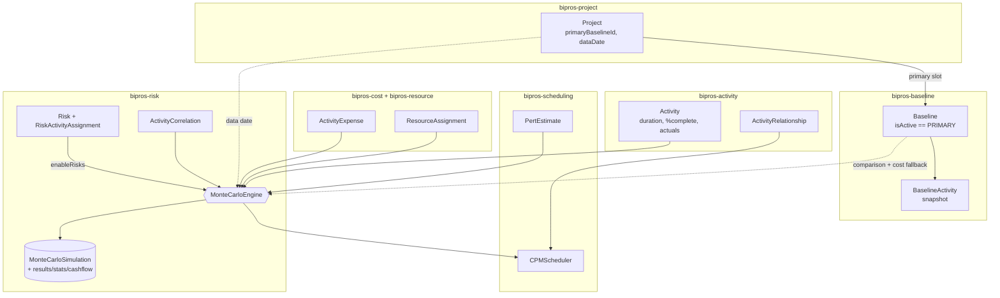

# Monte Carlo Risk Analysis — How It Works & Entity Relationships

> Module: `bipros-risk` · Engine: `MonteCarloEngine` · Schema: `risk`
> UI: `frontend/src/app/(app)/projects/[projectId]/risk-analysis`
> Last reviewed: 2026-06-27

---

## 1. What it is

A **probabilistic schedule + cost forecast** (PRA / Pertmaster-style). Instead of one
deterministic finish date and cost, it runs the project network thousands of times — each run
samples every activity's *remaining* duration from a probability distribution, re-runs **real CPM**,
and records the resulting project duration and cost. Aggregating those runs gives **confidence
bands**: P50 (likely case), P80 (conservative), criticality, sensitivity (tornado), milestone
finish-date CDFs, and a cost-loaded cashflow.

**One-line mental model:**

```
forecast = simulate( current live schedule + current approved costs ),  anchored to the data date,
           compared against ( the active baseline ).
```

The **baseline is the comparison reference, never the source of the forecast.** The forecast always
reflects the **current approved project state**.

---

## 2. Inputs

### 2.1 Run request (`MonteCarloRunRequest`) — what the user controls

`POST /v1/projects/{projectId}/monte-carlo/run`

| Field | Type | Default | Range / values | Meaning |
|---|---|---|---|---|
| `iterations` | int | `10000` | `100 … 100000` | Number of simulation runs. More = smoother percentiles, slower. |
| `defaultDistribution` | enum | `TRIANGULAR` | `TRIANGULAR`, `BETA_PERT`, `UNIFORM`, `NORMAL`, `LOGNORMAL`, `TRIGEN`, `DISCRETE` | Distribution used when an activity has no per-activity override. |
| `fallbackVariancePct` | double | `0.2` | `0.0 … 0.9` | ±band around the activity's duration when it has **no PERT estimate** (e.g. `0.2` = ±20%). |
| `enableRisks` | bool | `false` | — | When true, layers the **risk register** in as Bernoulli drivers (see §4.5). |
| `randomSeed` | long | `null` | — | Set for a reproducible run; omit for a fresh random stream. |

### 2.2 Data inputs — what the engine reads from the rest of the system

These are **not** passed in the request; the engine pulls them live at run time, keyed by `projectId`:

| Source entity | Module | Used for |
|---|---|---|
| **Active Baseline** (`Baseline`, `BaselineActivity`) | `bipros-baseline` | Comparison reference (baseline duration/cost), horizon sizing, fallback cost. **Required precondition.** |
| **Activities** (`Activity`) | `bipros-activity` | The live network to simulate: original/remaining duration, % complete, actual start/finish, calendar, type, constraints. |
| **Activity relationships** (`ActivityRelationship`) | `bipros-activity` | The CPM network (predecessor/successor, type, lag). |
| **PERT estimates** (`PertEstimate`) | `bipros-scheduling` | Per-activity three-point (O/M/P) duration distributions. |
| **Activity expenses + resource assignments** (`ActivityExpense`, `ResourceAssignment`) | `bipros-cost`, `bipros-resource` | **Live current approved cost** + actual cost incurred (EV split). |
| **Risk register** (`Risk`, `RiskActivityAssignment`) | `bipros-risk` | Bernoulli risk drivers (only when `enableRisks=true`). |
| **Activity correlations** (`ActivityCorrelation`) | `bipros-risk` | Correlated duration sampling (Iman–Conover reshuffle). |
| **Calendars** (`Calendar`) | `bipros-calendar` | Working-day arithmetic for the CPM and cashflow buckets. |
| **Project** (`Project.dataDate`) | `bipros-project` | (indirect) The "as of" point; the engine derives the data date from the latest reported actual. |

---

## 3. Relationship with **Baseline** (the key seam)

Monte Carlo and Baselines are coupled by **one hard dependency** and **one consistency invariant**.

### 3.1 An active baseline is a precondition

`MonteCarloEngine.resolveActiveBaseline()` requires the project to have an **active baseline with a
non-empty activity snapshot**. Otherwise it throws:

- `BASELINE_REQUIRED` — no active baseline.
- `BASELINE_EMPTY` — active baseline exists but has zero `BaselineActivity` rows.

The frontend pre-flights this and disables **Run Simulation** with a banner linking to the Baselines
tab when there is no active baseline — the user never triggers a blind failed run.

### 3.2 "Active baseline" = the project's PRIMARY slot (single source of truth)

The app has two historical notions of "the active baseline" that **must stay in lockstep**:

| Notion | Stored on | Read by |
|---|---|---|
| `Baseline.isActive` | the baseline row | **Monte Carlo**, AI baseline tools, analytics ETL |
| `Project.primaryBaselineId` (mirrored to `activeBaselineId`) | the project row | reporting variance/cost, EVM |

**Invariant (enforced in `BaselineService`):** `Baseline.isActive == true` **⟺** that baseline occupies
the project's **PRIMARY** slot. `createBaseline` makes a new baseline active only when it becomes the
first/primary one; `assignBaselineToSlot(PRIMARY)` / `setActiveBaseline` flips `isActive` to match;
`clearBaselineSlot`/`deleteBaseline` reconcile it. This guarantees Monte Carlo simulates **the same
baseline the rest of the app considers primary** — switching the primary baseline moves Monte Carlo
with it.

### 3.3 Baseline is a **comparison reference**, not the forecast source

The forecast costs and durations come from the **live project** (current activities, current approved
costs). The baseline only provides:

- `baselineDuration` — the deterministic CPM over the **full original** durations (the "plan" line).
- `baselineCost` — the baseline's total cost (the frozen comparison amount).
- A fallback cost source for any activity that has no live cost data.
- Horizon sizing for the simulation calendar bitmap.

When the live schedule has activities **not present in the active baseline** (added after capture),
they are costed from their **current approved values** (never silently zero) and the count is reported
as `activitiesNotInBaseline` — surfaced on the UI so the planner can re-baseline.

---

## 4. Relationship with the other entities

### 4.1 Activity (the simulated network)
The forecast is built on the **live** activities (`activityRepository.findByProjectId`), not the
baseline snapshot. From each activity the engine reads: `originalDuration`, `remainingDuration`,
`percentComplete`, `actualStartDate`/`actualFinishDate`, `calendarId`, `activityType`, constraints.

### 4.2 ActivityRelationship (the CPM logic)
Predecessor/successor links + relationship type (FS/SS/FF/SF) + lag form the network. Each iteration
runs `CPMScheduler` over this network with that iteration's sampled durations.

### 4.3 PertEstimate (per-activity distribution)
If an activity has a PERT row with valid Optimistic < Most-Likely < Pessimistic, its sampler is a
three-point distribution (`defaultDistribution` shape). Otherwise the engine builds a fallback band of
±`fallbackVariancePct` around the duration.

### 4.4 ActivityExpense + ResourceAssignment (live cost, EV-aware)
Forecast cost per activity = `ActivityCostCalculator.calculatePlannedCost(expenses + assignments)` —
the **current approved** cost. It is split EV-style:
- **actual incurred** (`calculateActualCost`) → **certain**, always in the cost.
- **remaining at risk** (`forecast − actual`) → scales with the sampled remaining duration.

### 4.5 Risk + RiskActivityAssignment (optional risk drivers)
Only when `enableRisks=true`. Each open risk with probability > 0, a non-zero schedule/cost impact, and
at least one resolvable affected activity becomes a **Bernoulli driver**: per iteration it fires with
its probability and, if it fires, adds sampled schedule days to its affected activities and sampled
cost to that iteration. Affected activities are resolved from the **union** of the
`RiskActivityAssignment` link table **and** the legacy `Risk.affectedActivities` free-text field.

### 4.6 ActivityCorrelation (correlated sampling)
Activities can be correlated so their durations move together. The engine builds a correlated uniform
matrix (Iman–Conover rank reshuffle) so correlated activities don't sample independently.

### 4.7 Project (data date)
The forecast's "as of" point. The data date is derived from the **latest reported actual**
(actual finish/start across activities); with no progress reported it falls back to the baseline /
project start, so a fresh project simulates its full schedule.

### 4.8 Calendar (working days)
All date math (CPM forward pass, project duration, cashflow buckets) uses each activity's working
calendar via a `CachingCalendarCalculator` bitmap, anchored at `min(projectStart, dataDate)`.

---

## 5. How the engine runs (pipeline)

```
resolveActiveBaseline(project)         → required; else BASELINE_REQUIRED / BASELINE_EMPTY
load live activities + relationships    → the network to simulate
derive data date                        → latest reported actual (else baseline/project start)
build forecast cost map (EV split)      → live planned cost; actual=certain, remaining=at-risk
build per-activity samplers             → PERT three-point, else ±fallbackVariancePct band
size calendar horizon + prime bitmap

for each of N iterations:
    sample each activity's REMAINING duration         (draw × remaining-fraction)
    (optional) apply risk-register Bernoulli drivers
    run CPMScheduler over the network                 → early start/finish per activity
    record  project duration  (earliest start → latest finish, working days)
    record  project cost      (Σ actual + remaining × sampled/planned ratio)
    record  per-activity critical-path membership, monthly cashflow, milestone finish

aggregate → percentiles (P10..P99), mean/σ, criticality index, duration/cost sensitivity,
            milestone finish CDFs, cashflow P-bands, risk contributions
persist   → MonteCarloSimulation (+ child result/stat/bucket/contribution rows)
```

**Progress awareness (EPPM):** only *remaining* work is uncertain. A 100%-complete activity contributes
0 duration uncertainty and only its actual cost; an in-progress activity samples just its remaining
fraction; a not-started activity samples its full duration. (Network logic is kept intact — progress is
modelled through the shortened *remaining duration*, not by pinning the scheduler to actuals.)

---

## 6. Outputs

### 6.1 Persisted entities (`risk` schema)

| Entity / table | Holds |
|---|---|
| `MonteCarloSimulation` | The run header: P10..P99 duration & cost, mean/σ, `baselineDuration`, `baselineCost`, `baselineId`, `dataDate`, `iterations`, `activitiesNotInBaseline`, `risksEnabled`, `status`, `configJson`. |
| `MonteCarloResult` | One row per iteration: `projectDuration`, `projectCost` (the raw distribution). |
| `MonteCarloActivityStat` | Per activity: `criticalityIndex`, `durationMean/Stddev/P10/P90`, `durationSensitivity`, `costSensitivity`, `cruciality`. |
| `MonteCarloMilestoneStat` | Per milestone: finish-date percentiles + CDF JSON. |
| `MonteCarloCashflowBucket` | Monthly cashflow P-bands + `baselineCumulative`. |
| `MonteCarloRiskContribution` | Per risk driver: occurrence rate, mean schedule/cost impact, affected activities. |

### 6.2 UI tabs (`risk-analysis`)
Overview (status, baseline duration/cost, iterations, data date, P-band tables + histograms) ·
Criticality · Tornado (sensitivity) · Milestones (finish CDFs) · Cash Flow · Risk Drivers
(with a **risks ON/OFF** badge). A scope-drift banner appears when `activitiesNotInBaseline > 0`.

---

## 7. API reference

Base: `/v1/projects/{projectId}/monte-carlo`

| Method | Path | Returns |
|---|---|---|
| `POST` | `/run` | Runs a simulation, returns the `MonteCarloSimulation`. |
| `GET` | `/latest` | Most recent simulation. |
| `GET` | `/{simulationId}` | A specific simulation. |
| `GET` | `/` | All simulations for the project. |
| `GET` | `/{simulationId}/activity-stats` | Per-activity stats. |
| `GET` | `/{simulationId}/criticality` | Activities ranked by criticality index. |
| `GET` | `/{simulationId}/milestone-stats` | Milestone finish CDFs. |
| `GET` | `/{simulationId}/cashflow` | Monthly cashflow P-bands. |
| `GET` | `/{simulationId}/risk-contributions` | Per-risk-driver contributions. |
| `GET` | `/{simulationId}/sensitivity-tornado?metric=duration\|cost` | Tornado ordering. |

---

## 8. Preconditions & failure modes

| Condition | Result |
|---|---|
| No active (PRIMARY) baseline | `BASELINE_REQUIRED` — UI disables Run + banner. |
| Active baseline has no activity snapshot | `BASELINE_EMPTY`. |
| Project has no activities | `NO_ACTIVITIES`. |
| No activity has a calendar | `NO_CALENDAR`. |
| Cannot determine a start date | `NO_START_DATE`. |
| CPM fails in an iteration | `CPM_FAILED`. |
| Live activities absent from the baseline | Costed from current values, reported as `activitiesNotInBaseline` (not an error). |

---

## 9. Entity relationship (at a glance)



---

## 10. Design principles (EPPM)

1. **Activities** come from the **live** project — the forecast reflects current scope.
2. **DPR / progress** (% complete, remaining duration) is honoured — only *remaining* work is uncertain.
3. **Baseline** is a **comparison/variance reference only**, never the live cost source.
4. The **forecast** uses the **current approved project state**; activities not in the baseline are
   reported (or prompt a re-baseline), never silently ignored.
