# Oman Barka–Nakhal Road Project — Data Flow

## Architecture Overview

```mermaid
flowchart TD
    subgraph Excel["3 Excel Workbooks (seed-data/oman-road-project/)"]
        X1["01-DPR-internal.xlsx<br/>Resource, Projection Vs Ach Summary"]
        X2["02-Capacity-Utilization.xlsx<br/>Plant/Manpower utilization, DPR rates, Daily Deployment"]
        X3["03-Supervisor-Engineer-CM-PM-DBS.xlsx<br/>Project info, BOQ, Equipment master, Financial summaries"]
    end

    subgraph Reader["OmanRoadProjectWorkbookReader (@Component)"]
        R1["readProjectInfo()"]
        R2["readBoqItems()"]
        R3["readBoqRates()"]
        R4["readEquipmentMaster()"]
        R5["readProductivityNorms()"]
        R6["readIndirectStaff() / readDirectLabour()"]
        R7["readSupervisorProjection()"]
        R8["readFinancialSupervisors()"]
        R9["readEquipmentDeployment()"]
        R10["readPlantSummary() / readEquipmentMpDays()"]
        R11["readMaterialBoqRates()"]
    end

    subgraph MasterData["Master-Data Layer (every profile, runs first)"]
        M1["DataSeeder (admin/role/currency)"]
        M2["ProjectCategoryMasterSeeder"]
        M3["ResourceTypeSeeder"]
        M4["RiskCategorySeeder"]
        M5["RiskTemplateSeeder"]
        M6["PermitPackSeeder"]
        M7["OmanLabourMasterSeeder @Order(140)"]
    end

    subgraph OmanSeeders["Oman Demo Layer (@Profile('seed'))"]
        direction TB
        S1["OmanRoadProjectSeeder (141)<br/>EPS, OBS(25), Calendar, Project, WBS, BOQ,<br/>Resources, Activities, Stretches, SQL bundle"]
        S2["OmanRoadDailyDataSeeder (143)<br/>DPR, Deployment, Weather, Materials,<br/>Equipment Logs, Labour Returns"]
        S3["OmanContractSeeder (144)<br/>Contract, Milestones, Scorecards, VOs"]
        S4["OmanRaBillSeeder (145)<br/>12 monthly RA Bills + Items"]
        S5["OmanRoadAttachmentsSeeder (146)<br/>Document register, PDF stubs"]
        S6["OmanFundingSeeder (147)<br/>FundingSource, ProjectFunding, CashFlow"]
        S7["OmanFinancialPeriodSeeder (148)<br/>FinancialPeriod, StorePeriodPerformance"]
        S8["OmanScheduleScenarioSeeder (149)<br/>ScheduleResult, PERT, Compression, Health"]
        S9["OmanRoadProjectSupplementalSeeder (151)<br/>Risks, Drawings, RFIs, Transmittals,<br/>Scenarios, Cost Accounts, EVM,<br/>ActivityCodes, CalendarExceptions"]
        S10["OmanPermitSeeder (152)<br/>30 Permits + Workers/Tests/Approvals"]
        S11["OmanRiskMasterSeeder (153)<br/>RiskScoringConfig, Activity assignments"]
        S12["OmanReportingSeeder (154)<br/>KPIs, Snapshots, Dashboards, Reports"]
        S13["OmanGisSeeder (155)<br/>GIS Layers, WBS Polygons, Satellite"]
        S14["OmanUdfSeeder (156)<br/>User-Defined Fields + Values"]
        S15["OmanPortfolioSeeder (157)<br/>Scoring Model"]
        S16["OmanAnalyticsSeeder (158)<br/>Analytics Queries, Predictions, Monte Carlo"]
        S17["OmanRoadProjectBaselineSeeder (161)<br/>BL1 Original + BL2 Re-forecast"]
        S18["ProjectResourcePoolBackfill (960)"]
        S19["DefaultFolderStartupBackfill"]
    end

    subgraph SQL["SQL Report Bundle (23 files)"]
        SQL1["00-currency-omr.sql"]
        SQL2["01-wbs-budget.sql"]
        SQL3["02-activity-progress.sql"]
        SQL4["07-evm-calculations.sql"]
        SQL5["09-risks.sql"]
        SQL6["10-contracts.sql"]
        SQL7["11-ra-bills.sql"]
        SQL8["...15 more files"]
    end

    subgraph DB["PostgreSQL (project, activity, resource, cost, risk, baseline, schedule, contract, document, permit, gis, evm, portfolio, udf, reporting schemas)"]
        DB1["~50+ tables populated"]
    end

    subgraph API["Spring Data JPA → Service → Controller (REST)"]
        API1["/v1/projects, /v1/activities, /v1/contracts, ..."]
    end

    subgraph FE["Frontend (Next.js App Router)"]
        FE1["axios client.ts (JWT) → *Api.ts per domain"]
        FE2["33+ project tabs all populated"]
    end

    X1 --> R6 --> R7
    X2 --> R3 --> R5 --> R9
    X3 --> R1 --> R2 --> R4 --> R8 --> R10 --> R11

    M1 & M2 & M3 & M4 & M5 & M6 --> DB
    M7 --> S1

    S1 --> SQL --> DB
    S1 --> S2 & S3 & S4 & S5 & S6 & S7 & S8
    S1 --> S9 & S10 & S11 & S12 & S13 & S14 & S15 & S16
    S1 --> S17 & S18 & S19
    S2 & S3 & S4 & S6 & S7 & S8 --> DB
    S9 & S10 & S11 & S12 & S13 & S14 & S15 & S16 --> DB
    S17 & S18 & S19 --> DB

    DB --> API --> FE
```

## Seeder Execution Order

| Order | Seeder | Profile | Tables Populated |
|-------|--------|---------|-----------------|
| — | DataSeeder | (none) | admin, roles, currencies |
| — | ProjectCategoryMasterSeeder | seed | project_categories |
| — | ResourceTypeSeeder | seed | resource_types |
| — | RiskCategorySeeder | seed | risk_categories |
| — | RiskTemplateSeeder | seed | risk_templates |
| — | PermitPackSeeder | seed | permit_type_templates |
| 140 | OmanLabourMasterSeeder | seed | labour_designations |
| 141 | OmanRoadProjectSeeder | seed | eps_nodes, obs_nodes, calendars, calendar_work_weeks, projects, wbs_nodes, boq_items, productivity_norms, resources, resource_rates, resource_roles, activities, activity_relationships, stretches, stretch_activity_links |
| 143 | OmanRoadDailyDataSeeder | seed | daily_progress_reports, daily_resource_deployments, daily_weather, next_day_plans, materials, material_sources, material_stock, goods_receipt_notes, material_reconciliations, material_consumption_logs, equipment_logs, labour_returns |
| 144 | OmanContractSeeder | seed | contracts, contract_milestones, contractor_scorecards, variation_orders |
| 145 | OmanRaBillSeeder | seed | ra_bills, ra_bill_items |
| 146 | OmanRoadAttachmentsSeeder | seed | documents, document_versions, document_folders |
| 147 | OmanFundingSeeder | seed | funding_sources, project_funding, cash_flow_forecasts |
| 148 | OmanFinancialPeriodSeeder | seed | financial_periods, store_period_performance |
| 149 | OmanScheduleScenarioSeeder | seed | schedule_results, schedule_activity_results, compression_analyses, pert_estimates, schedule_health_indices |
| 151 | OmanRoadProjectSupplementalSeeder | seed | risk_responses, risk_triggers, risk_activity_assignments, drawing_register, rfi_register, transmittals, transmittal_items, schedule_scenarios, activity_correlations, cost_accounts, evm_calculations, activity_codes, activity_code_assignments, calendar_exceptions, resource_daily_logs |
| 152 | OmanPermitSeeder | seed | permit, permit_worker, permit_gas_test, permit_approval |
| 153 | OmanRiskMasterSeeder | seed | risk_scoring_config, risk_activity_assignments |
| 154 | OmanReportingSeeder | seed | kpi_definitions, kpi_snapshots, kpi_node_snapshots, monthly_evm_snapshots, dashboard_configs, report_definitions, report_executions |
| 155 | OmanGisSeeder | seed | gis_layers, wbs_polygons, satellite_scene_ingestion_log, construction_progress_snapshots |
| 156 | OmanUdfSeeder | seed | user_defined_fields, udf_values |
| 157 | OmanPortfolioSeeder | seed | scoring_models |
| 158 | OmanAnalyticsSeeder | seed | analytics_queries, predictions, monte_carlo_cashflow_buckets |
| 161 | OmanRoadProjectBaselineSeeder | seed | baselines, baseline_activities, baseline_relationships |
| 960 | ProjectResourcePoolBackfill | (none) | project_resources |
| — | DefaultFolderStartupBackfill | (none) | document_folders |

## Per-Tab Cross-Reference

| Frontend Tab | Primary Entity | Seeder | Excel Source |
|-------------|---------------|--------|-------------|
| `/projects/6155/dpr` | DailyProgressReport | OmanRoadDailyDataSeeder (143) | Synthetic (File 1 pattern) |
| `/projects/6155/activities` | Activity | OmanRoadProjectSeeder (141) | File 3 DPR (BOQ items) |
| `/projects/6155/relationships` | ActivityRelationship | OmanRoadProjectSeeder (141) | Deterministic chain |
| `/projects/6155/wbs` | WbsNode | OmanRoadProjectSeeder (141) | File 3 DPR (BOQ sections) |
| `/projects/6155/boq` | BoqItem | OmanRoadProjectSeeder (141) | File 3 DPR + File 2 rates |
| `/projects/6155/resources` | Resource | OmanRoadProjectSeeder (141) | JSON master + File 3 Eqpt |
| `/projects/6155/materials` | MaterialConsumptionLog | OmanRoadDailyDataSeeder (143) | Synthetic |
| `/projects/6155/equipment-logs` | EquipmentLog | OmanRoadDailyDataSeeder (143) | Synthetic |
| `/projects/6155/labour-returns` | LabourReturn | OmanRoadDailyDataSeeder (143) | Synthetic |
| `/projects/6155/grns` | GoodsReceiptNote | OmanRoadDailyDataSeeder (143) | Synthetic |
| `/projects/6155/material-reconciliation` | MaterialReconciliation | OmanRoadDailyDataSeeder (143) | Synthetic |
| `/projects/6155/material-consumption` | MaterialConsumptionLog | OmanRoadDailyDataSeeder (143) | Synthetic |
| `/projects/6155/stock-register` | MaterialStock | OmanRoadDailyDataSeeder (143) | Synthetic |
| `/projects/6155/contracts` | Contract | OmanContractSeeder (144) | File 3 Summary-Financial |
| `/projects/6155/ra-bills` | RaBill | OmanRaBillSeeder (145) | File 3 Summary-Financial |
| `/projects/6155/budget-changes` | (SQL bundle) | OmanRoadProjectSeeder (141) | SQL 19-budget-changes.sql |
| `/projects/6155/variation-orders` | VariationOrder | OmanContractSeeder (144) | Synthetic |
| `/projects/6155/risk-analysis` | RiskScoringConfig | OmanRiskMasterSeeder (153) | Synthetic |
| `/projects/6155/risks` | Risk + Response + Trigger | Supplemental (151) + SQL 09 | SQL 09-risks.sql |
| `/projects/6155/schedule-compression` | CompressionAnalysis | OmanScheduleScenarioSeeder (149) | Synthetic |
| `/projects/6155/schedule-health` | ScheduleHealthIndex | OmanScheduleScenarioSeeder (149) | Synthetic |
| `/projects/6155/capacity-utilization` | ProductivityNorm | OmanRoadProjectSeeder (141) | File 2 Plant/Manpower |
| `/projects/6155/gis-viewer` | GisLayer + WbsPolygon | OmanGisSeeder (155) | Synthetic + satellite JPEGs |
| `/projects/6155/predictions` | Prediction | OmanAnalyticsSeeder (158) | Synthetic |
| `/projects/6155/issues` | RfiRegister | Supplemental (151) | Synthetic |
| `/projects/6155/global-change` | ActivityCode | Supplemental (151) | File 3 supervisors |
| `/projects/6155/drawings` | DrawingRegister | Supplemental (151) | Synthetic |
| `/projects/6155/rfis` | RfiRegister | Supplemental (151) | Synthetic |
| `/projects/6155/documents` | Document | OmanRoadAttachmentsSeeder (146) | Synthetic PDFs |
| `/projects/6155/daily-outputs` | ResourceDailyLog | Supplemental (151) | Synthetic |
| `/projects/6155/next-day-plan` | NextDayPlan | OmanRoadDailyDataSeeder (143) | Synthetic |
| `/projects/6155/weather-log` | DailyWeather | OmanRoadDailyDataSeeder (143) | Synthetic (Oman climate) |
| `/projects/6155/stretches` | Stretch | OmanRoadProjectSeeder (141) | Synthetic (41 km corridor) |
| `/dashboards/*` | DashboardConfig | OmanReportingSeeder (154) | Synthetic |
| `/admin/*` | DataSeeder | DataSeeder | Static |
| `/labour-master` | LabourDesignation | OmanLabourMasterSeeder (140) | oman-labour-master.json |
| `/eps` | EpsNode | OmanRoadProjectSeeder (141) | Synthetic (OHA hierarchy) |
| `/obs` | ObsNode | OmanRoadProjectSeeder (141) | File 3 supervisors + synthetic |
| `/permits` | Permit | OmanPermitSeeder (152) | Synthetic |
| `/reports/*` | ReportDefinition + Execution | OmanReportingSeeder (154) | Synthetic |
| `/portfolios` | ScoringModel | OmanPortfolioSeeder (157) | Synthetic |
| `/risk` | Risk | Supplemental (151) + SQL 09 | SQL 09-risks.sql |
